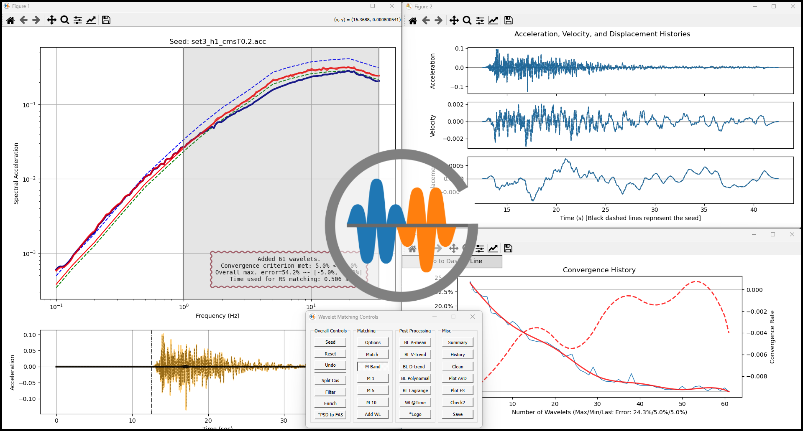

# Greedy Wavelet Method (GWM) 

GWM is a standalone software package based on the algorithm published in: 
"A greedy algorithm for wavelet-based time domain response spectrum matching" 
(Nie, Graizer, and Seber, *Nuclear Engineering and Design*, **410**(112384), 15 August 2023; https://doi.org/10.1016/j.nucengdes.2023.112384)


- [Dislaimer, Copyright Notice, and Contributions and Support](#dislaimer-copyright-notice-and-contributions-and-support)
- [Dependencies](#dependencies)
- [GWM Installation](#gwm-installation)
  - [Binary Files](#binary-files)
  - [Dependencies (DLL Files)](#dependencies-dll-files)
- [Tests](#tests)




## Dislaimer, Copyright Notice, and Contributions and Support
[Please read here &#x1F517;](Disclaimer-Copyright-Notice-Contributions-Support.md)


## Dependencies

The current binaries are compatible with Python 3.12, which can be installed from either python.org or Anaconda3. Other Python versions may work with minor modifications to the source code.

**Note:** Install the following packages only if Python 3.12 is installed using the installer from python.org. Anaconda3 includes all these packages by default, but commercial use requires purchasing a license.

Required packages:
```
numpy ~= 1.26.4
scipy ~= 1.13.1
matplotlib ~= 3.9.2
PyQt5 ~= 5.15.10
pillow ~= 10.4.0
```

## GWM Installation

1. Copy the entire `GWM` folder to a location on your local drive
2. Add that folder to your `PYTHONPATH` environment variable (create the variable if it doesn't exist)

### Binary Files

The package includes three Python extension modules with `.pyd` file extensions. These are Fortran codes compiled using mingw64 for Python 3.12:

- If you are using **Python 3.12**: You can use these files directly
- If you are using **other Python versions**: You will need to recompile the Fortran source files located in the `gwm/fsrc` folder (batch files are provided for compilation)

### Dependencies (DLL Files)

The `mingw64_deps` folder contains several `.dll` files from the compiler. These files are required by the .pyd modules and should be copied to the same folder as the .pyd files. If you recompile the Fortran source code, these .dll files are not needed.

## Tests

Two test scripts are provided in the `tests` folder to demonstrate how to create starting scripts for using GWM:

- Benchmark_RspMatch09_example.py
- test_RG1.60.py

To execute these scripts, use the following commands in a CMD window or PowerShell prompt:

```
python Benchmark_RspMatch09_example.py
python test_RG1.60.py
``` 

