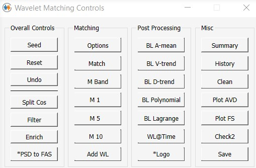

#  <nobr>Super Brief Manual for Greedy Wavelet Method (GWM) </nobr> 

- [Introduction](#introduction)
- [Functions of the Buttons](#functions-of-the-buttons)
  - [Levels of Difficulty](#levels-of-difficulty)
  - [Overall Controls](#overall-controls)
  - [Matching](#matching)
  - [Post Processing](#post-processing)
  - [Misc](#misc)

## Introduction 

GWM is a standalone software package based on the algorithm published in: 
"*A greedy algorithm for wavelet-based time domain response spectrum matching*" 
(Nie, Graizer, and Seber, Nuclear Engineering and Design, **410**(112384), 15 August 2023; https://doi.org/10.1016/j.nucengdes.2023.112384). This publication outlines the core methodology behind GWM, establishing its foundation as a robust and efficient tool for time-domain response spectrum (RS) matching using wavelet-based techniques.

Additional insights into the application of GWM can be found in "*Exploration of the Effects of Response Spectrum Matching on Power Spectral Density Functions*" (Nie, ASME Pressure Vessels & Piping Conference 2024, PVP2024-125200). Both this study and the original algorithm paper conclude that GWM achieves RS matching without significantly altering the power distribution of the input record. These findings support two primary use cases for GWM: (1) performing RS matching while preserving the seed record’s original characteristics as much as possible, and (2) achieving both RS matching and power sufficiency through a two-step process—(a) replacing the Fourier Amplitude Spectrum of the seed using a target power spectral density function compatible with the design RS, and (b) applying GWM to complete the RS matching.

## Functions of the Buttons

A comprehensive user manual has not yet been developed to describe the functions, dialogs, and theories. The buttons shown in the dialog above are described briefly according to the four groups shown in the interface.

### Levels of Difficulty

GWM can be explored using three levels of difficulty for the buttons. 

> **Level 1 Buttons**: Reset, Match, M Band, M1, M5, M10, Add WL, *Logo, Summary, History, Clean, Plot AVD, Plot FS, Check 2, Save 

> **Level 2 Buttons**: Seed, Undo, BL A-mean, BL V-trend, BL D-Trend, BL Polynomial

> **Level 3 Buttons**: Split Cos, Filter, Enrich, *PSD to FAS, Options, BL Lagrange, WL@Time

### Overall Controls

> **Seed**  

The *Seed* button opens a file dialog to load a new seed in supported acceleration formats and re-initializes the project.

> **Reset**

The *Reset* button re-initializes the project using the original seed provided when starting the application.

> **Undo**

For each click, the *Undo* button reverts the last action or removes 10 wavelets for a long matching process.

> **Split Cos**

The *Split Cos* button applies a split cosine envelope function (5% at the beginning and at the end) to remove non-zero start and end values, which can occur if a wavelet is added too close to the beginning or end of the time history.  

> **Filter**

The *Filter* button applies a Butterworth filter to reduce high frequency content beyond a frequency that the user selects from the response spectrum plot. 

> **Enrich**

The *Enrich* button modifies the magnitude of the acceleration time history at each time step, following a Gaussian distribution centered at that magnitude with a 5% coefficient of variation. 

> **\*PSD to FAS**

The _\*PSD to FAS_ button replaces the Fourier Amplitude Spectrum based on the target Power Spectral Density (PSD) function if provided. 

### Matching

> **Options**

The *Options* button opens a dialog for adjusting various parameters. These parameters can be set when initializing a WaveletMatch object (in object-oriented programming terms). All parameters use their default values defined in the code if not explicitly provided. 

> **Match**

The *Match* button is the primary button that users will use to start the response spectrum (RS) matching process. Each click adds up to a specified maximum number of wavelets, with a default value of 300. 

> **M Band**

The *M Band* button allows matching to occur within a selected frequency range. It can also be used to simulate RspMatch09 passes by selecting a frequency range for each pass. 

> **M1**, **M5**, **M10**

These buttons add one, five, or ten wavelets with each click. They are useful for observing how wavelets are added progressively based on the greedy algorithm.

> **Add WL**

The *Add WL* button adds a wavelet at a user-selected frequency. The time of the wavelet center is determined automatically by the program.

> **WL@Time** (under Post Processing, to reduce the height of the toolbox)

The *WL@Time* button adds a wavelet at a user-selected frequency and time. This is a toggle button; when checked, it allows the frequency, time, and magnitude of the wavelet to be changed by dragging the circles on the RS plot and the acceleration time history plot. 

### Post Processing

These buttons (except for *WL@Time*) provide baseline correction functionality. GWM does not enforce zero drift during the RS matching process, but it provides convenient and powerful baseline correction tools. All changes are applied directly to the acceleration time history, ensuring that the acceleration, velocity, and displacement (AVD) histories remain consistent. 

> **BL A-mean**

The *BL A-Mean* button removes a constant mean from the resultant acceleration time history, if present. This button is not frequently used. 

> **BL V-trend**

The *BL V-trend* button removes trends in the velocity time history using splines. The parameters defining the splines can be adjusted in the dialog. 

> **BL D-trend**

The *BL D-trend* button removes trends in the displacement time history using splines. The parameters defining the splines and the weights used in their calculation can be adjusted in the dialog.  

> **BL Polynomial**

The *BL Polynomial* button removes trends in the displacement time history using a polynomial. The polynomial degree can be adjusted within the range of 2 to 20, and the weights used in the calculation can also be modified.  

> **BL Lagrange**

The *BL Lagrange* button removes trends in the displacement time history using a Lagrange multiplier method. The reference for this algorithm will be provided in a future update. 

> **\*Logo**

The *Logo* button displays the logo. This button is a placeholder for a *Help* button that will provide online help in future implementations.

### Misc 

> **Summary**

The *Summary* button toggles the display of the text box with curly borders, which shows relevant convergence information.

> **History**

The *History* button opens the convergence history dialog. 

> **Clean**

The *Clean* button removes auxiliary lines, curves, text, and other elements. It is useful when users want to save clean figures. 

> **Plot AVD**

The *Plot AVD* button adds the current AVD time histories to the AVD plot. Closing and re-plotting will display only the seed and final time histories. 

> **Plot FS**

The *Plot FS* button displays the Fourier Spectra (FS), including both the Fourier amplitude spectrum and the Fourier phase spectrum. 

> **Check2**

The *Check2* button displays a comparison of the final response spectrum against the SRP Section 3.7.1 Option 1, Approach 2 criteria. 

> **Save**

The *Save* button saves relevant images and the AVD time histories in text format. 

[def]: #misc